<h1 align='center'>CONFEREX</h1>

- An international conference management website designed in HTML, CSS and JS/Bootstrap.

## About the Website

- ‘CONFEREX’ helps in an easy review of the process and offers several services such as attending the conference events involving keynote sessions, invited talks, research paper presentations, poster presentations etc. This web based application will also feature an activity dashboard which will display the current status along with the scheduled programs.ConfereX provides the facility for creating the meet/conference. The Host can create the meeting for different schedules.The Speakers Can be added for the meetings created. The Speakers will take the keynote Session.The Host will be able to update the schedules according to the planned meetings. Other attendees will be able to view the schedule of conference. The Host, Keynote Speaker, Reviewers and participants can attend the meeting created by the Host and take part in the conference.
- <b>Languages and Technologies used : </b> HTML, CSS, JS/Bootstrap & Firebase
- <b>Author Name :</b> Anuj Jain, Prashant Singh Chauhan, Neha Singh, Pradumn Kumar & Vimal Vinayak

- <b>Website link : </b>[Click here✨](https://neha-oo1.github.io/confereX/)

- <b>Login Details : </b> 
  - Username: user
  - Password: User@12345

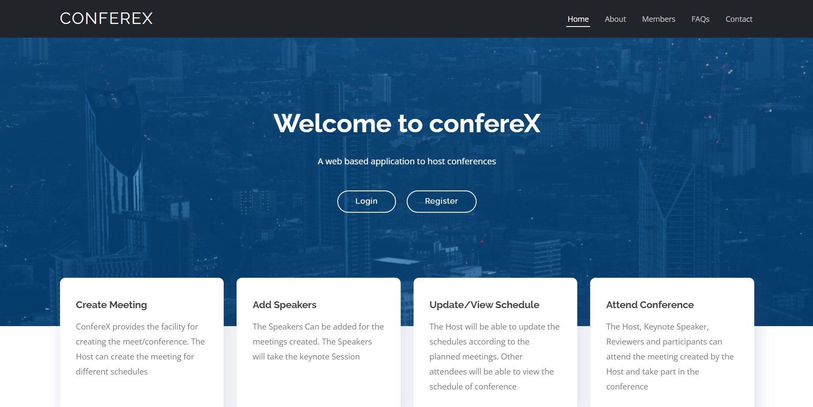
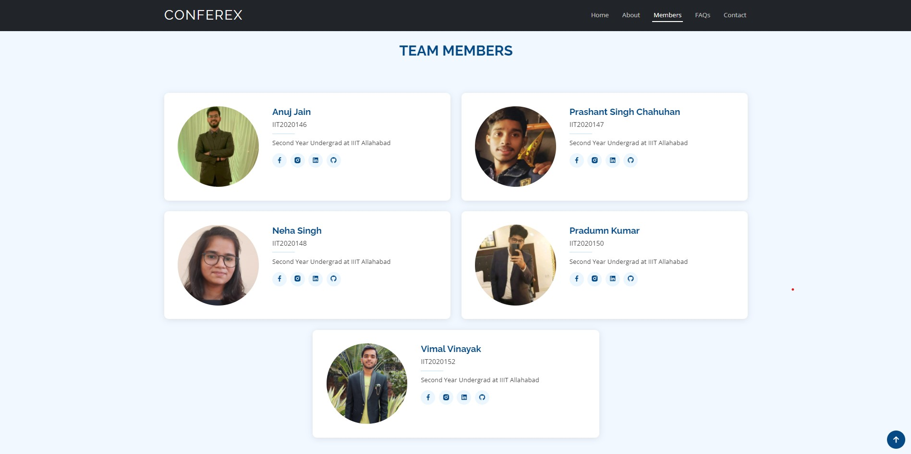

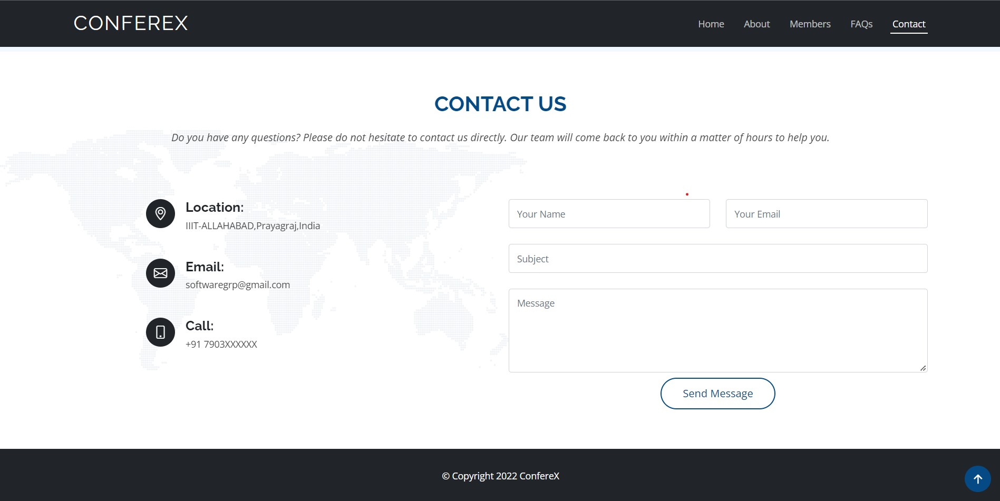
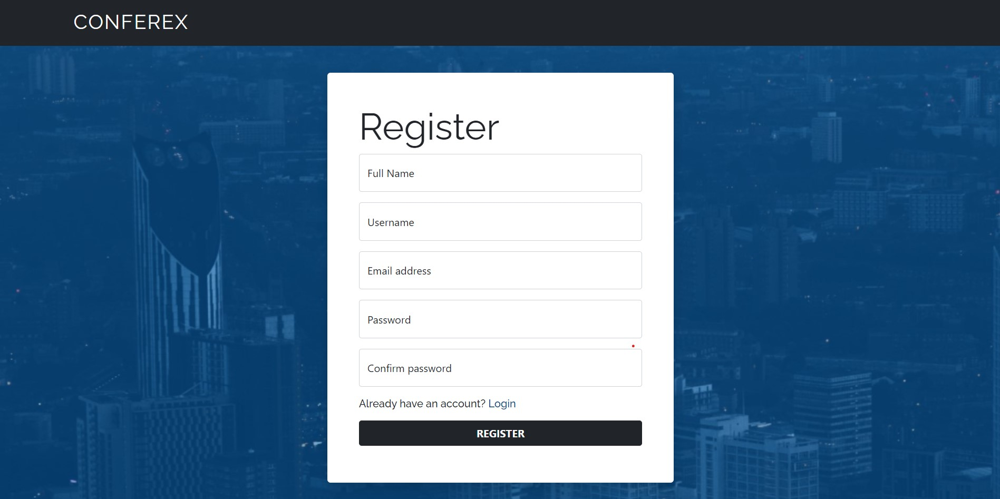
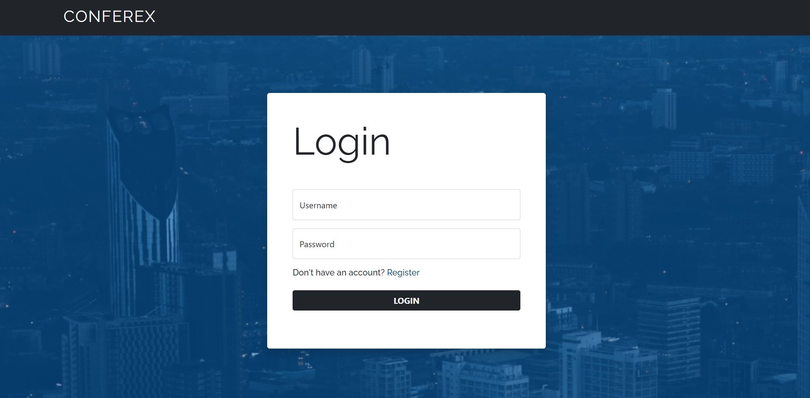
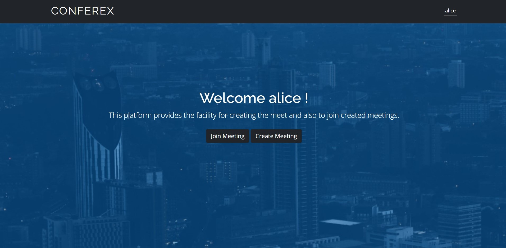

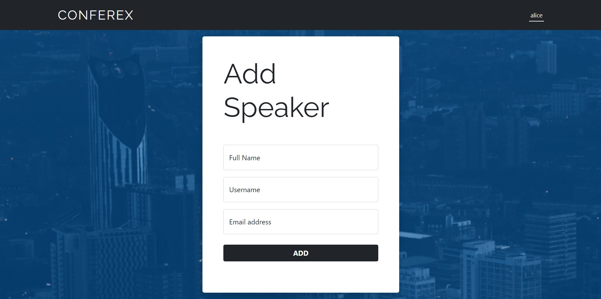
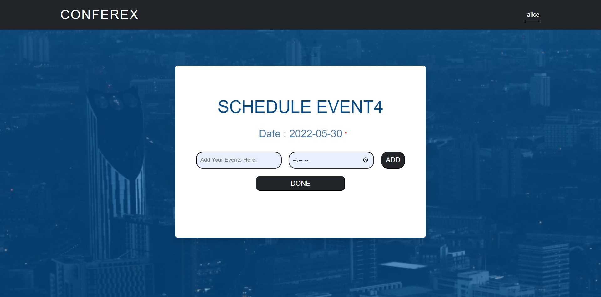

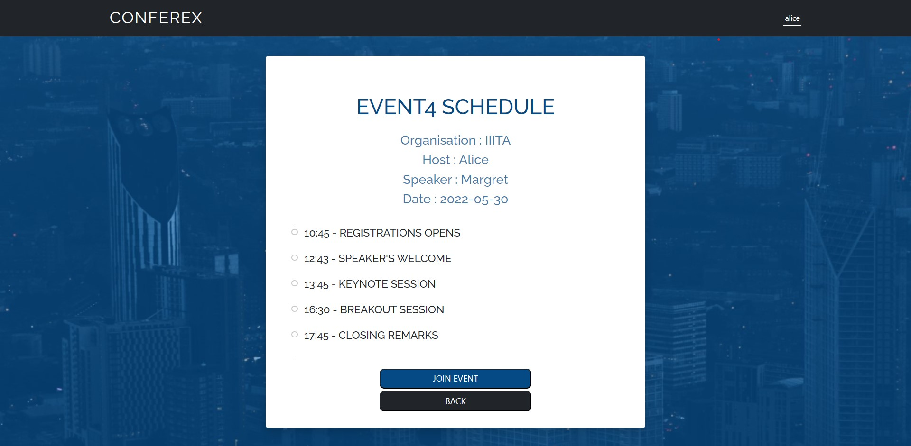
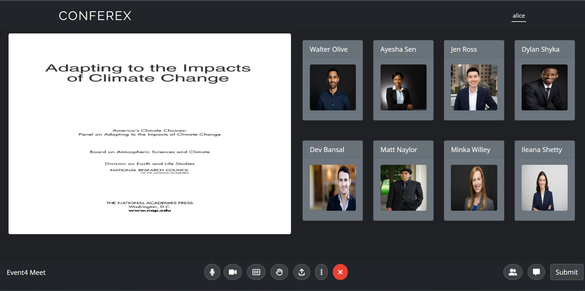
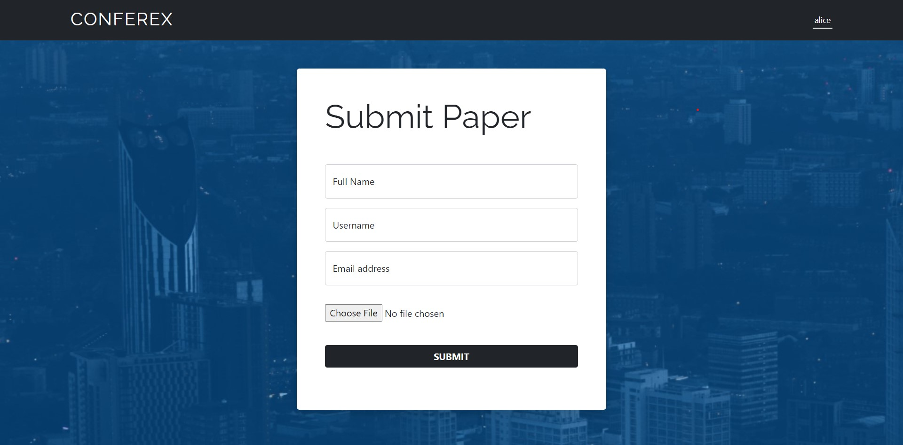
